```python
import pandas as pd
import matplotlib.pyplot as plt
import seaborn as sns

file = 'Data/un-debates.csv'
df = pd.read_csv(file)
df.sample(2)
```


<div>
<style scoped>
    .dataframe tbody tr th:only-of-type {
        vertical-align: middle;
    }

    .dataframe tbody tr th {
        vertical-align: top;
    }

    .dataframe thead th {
        text-align: right;
    }
</style>
<table border="1" class="dataframe">
  <thead>
    <tr style="text-align: right;">
      <th></th>
      <th>session</th>
      <th>year</th>
      <th>country</th>
      <th>country_name</th>
      <th>speaker</th>
      <th>position</th>
      <th>text</th>
    </tr>
  </thead>
  <tbody>
    <tr>
      <th>5846</th>
      <td>62</td>
      <td>2007</td>
      <td>HTI</td>
      <td>Haiti</td>
      <td>René Garcia Préval</td>
      <td>President</td>
      <td>Allow me at \nthe outset to congratulate Mr. K...</td>
    </tr>
    <tr>
      <th>5481</th>
      <td>60</td>
      <td>2005</td>
      <td>KGZ</td>
      <td>Kyrgyzstan</td>
      <td>Kurmanbek Bakiev</td>
      <td>President</td>
      <td>At the\noutset, I would like to congratulate y...</td>
    </tr>
  </tbody>
</table>
</div>


```python
# add new column: text length to get additional information about the distribution of the lengths of the speeches
df['length'] = df['text'].str.len()
df.describe().T
```


<div>
<style scoped>
    .dataframe tbody tr th:only-of-type {
        vertical-align: middle;
    }

    .dataframe tbody tr th {
        vertical-align: top;
    }

    .dataframe thead th {
        text-align: right;
    }
</style>
<table border="1" class="dataframe">
  <thead>
    <tr style="text-align: right;">
      <th></th>
      <th>count</th>
      <th>mean</th>
      <th>std</th>
      <th>min</th>
      <th>25%</th>
      <th>50%</th>
      <th>75%</th>
      <th>max</th>
    </tr>
  </thead>
  <tbody>
    <tr>
      <th>session</th>
      <td>7507.0</td>
      <td>49.610763</td>
      <td>12.892155</td>
      <td>25.0</td>
      <td>39.0</td>
      <td>51.0</td>
      <td>61.0</td>
      <td>70.0</td>
    </tr>
    <tr>
      <th>year</th>
      <td>7507.0</td>
      <td>1994.610763</td>
      <td>12.892155</td>
      <td>1970.0</td>
      <td>1984.0</td>
      <td>1996.0</td>
      <td>2006.0</td>
      <td>2015.0</td>
    </tr>
    <tr>
      <th>length</th>
      <td>7507.0</td>
      <td>17967.281604</td>
      <td>7860.038463</td>
      <td>2362.0</td>
      <td>12077.0</td>
      <td>16424.0</td>
      <td>22479.5</td>
      <td>72041.0</td>
    </tr>
  </tbody>
</table>
</div>


```python
df[['country', 'speaker']].describe(include='O').T
```


<div>
<style scoped>
    .dataframe tbody tr th:only-of-type {
        vertical-align: middle;
    }

    .dataframe tbody tr th {
        vertical-align: top;
    }

    .dataframe thead th {
        text-align: right;
    }
</style>
<table border="1" class="dataframe">
  <thead>
    <tr style="text-align: right;">
      <th></th>
      <th>count</th>
      <th>unique</th>
      <th>top</th>
      <th>freq</th>
    </tr>
  </thead>
  <tbody>
    <tr>
      <th>country</th>
      <td>7507</td>
      <td>199</td>
      <td>ALB</td>
      <td>46</td>
    </tr>
    <tr>
      <th>speaker</th>
      <td>7480</td>
      <td>5428</td>
      <td>Seyoum Mesfin</td>
      <td>12</td>
    </tr>
  </tbody>
</table>
</div>


```python
df.isna().sum()
```


    session            0
    year               0
    country            0
    country_name       0
    speaker           27
    position        3005
    text               0
    length             0
    dtype: int64


```python
df['speaker'].fillna('unknown', inplace=True)
```


```python
df.isna().sum()
```


    session            0
    year               0
    country            0
    country_name       0
    speaker            0
    position        3005
    text               0
    length             0
    dtype: int64


```python
df[df['speaker'].str.contains('Bush')]['speaker'].value_counts()
```


    George W. Bush        4
    Mr. George W. Bush    2
    Bush                  1
    George Bush           1
    Mr. George W Bush     1
    Name: speaker, dtype: int64


```python
df['length'].plot(kind='box', vert=False)
```


    <AxesSubplot:>


    
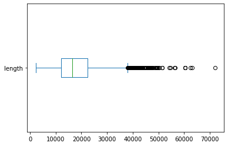
    


```python
df['length'].plot(kind='hist', bins=30)
```


    <AxesSubplot:ylabel='Frequency'>


    
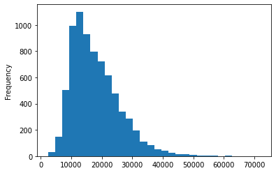
    


```python
df.head()
```


<div>
<style scoped>
    .dataframe tbody tr th:only-of-type {
        vertical-align: middle;
    }

    .dataframe tbody tr th {
        vertical-align: top;
    }

    .dataframe thead th {
        text-align: right;
    }
</style>
<table border="1" class="dataframe">
  <thead>
    <tr style="text-align: right;">
      <th></th>
      <th>session</th>
      <th>year</th>
      <th>country</th>
      <th>country_name</th>
      <th>speaker</th>
      <th>position</th>
      <th>text</th>
      <th>length</th>
    </tr>
  </thead>
  <tbody>
    <tr>
      <th>0</th>
      <td>25</td>
      <td>1970</td>
      <td>ALB</td>
      <td>Albania</td>
      <td>Mr. NAS</td>
      <td>NaN</td>
      <td>33: May I first convey to our President the co...</td>
      <td>51419</td>
    </tr>
    <tr>
      <th>1</th>
      <td>25</td>
      <td>1970</td>
      <td>ARG</td>
      <td>Argentina</td>
      <td>Mr. DE PABLO PARDO</td>
      <td>NaN</td>
      <td>177.\t : It is a fortunate coincidence that pr...</td>
      <td>29286</td>
    </tr>
    <tr>
      <th>2</th>
      <td>25</td>
      <td>1970</td>
      <td>AUS</td>
      <td>Australia</td>
      <td>Mr. McMAHON</td>
      <td>NaN</td>
      <td>100.\t  It is a pleasure for me to extend to y...</td>
      <td>31839</td>
    </tr>
    <tr>
      <th>3</th>
      <td>25</td>
      <td>1970</td>
      <td>AUT</td>
      <td>Austria</td>
      <td>Mr. KIRCHSCHLAEGER</td>
      <td>NaN</td>
      <td>155.\t  May I begin by expressing to Ambassado...</td>
      <td>26616</td>
    </tr>
    <tr>
      <th>4</th>
      <td>25</td>
      <td>1970</td>
      <td>BEL</td>
      <td>Belgium</td>
      <td>Mr. HARMEL</td>
      <td>NaN</td>
      <td>176. No doubt each of us, before coming up to ...</td>
      <td>25911</td>
    </tr>
  </tbody>
</table>
</div>


```python
df['length'] = df['text'].str.len()
```


```python
df.head()
```


<div>
<style scoped>
    .dataframe tbody tr th:only-of-type {
        vertical-align: middle;
    }

    .dataframe tbody tr th {
        vertical-align: top;
    }

    .dataframe thead th {
        text-align: right;
    }
</style>
<table border="1" class="dataframe">
  <thead>
    <tr style="text-align: right;">
      <th></th>
      <th>session</th>
      <th>year</th>
      <th>country</th>
      <th>country_name</th>
      <th>speaker</th>
      <th>position</th>
      <th>text</th>
      <th>length</th>
    </tr>
  </thead>
  <tbody>
    <tr>
      <th>0</th>
      <td>25</td>
      <td>1970</td>
      <td>ALB</td>
      <td>Albania</td>
      <td>Mr. NAS</td>
      <td>NaN</td>
      <td>33: May I first convey to our President the co...</td>
      <td>51419</td>
    </tr>
    <tr>
      <th>1</th>
      <td>25</td>
      <td>1970</td>
      <td>ARG</td>
      <td>Argentina</td>
      <td>Mr. DE PABLO PARDO</td>
      <td>NaN</td>
      <td>177.\t : It is a fortunate coincidence that pr...</td>
      <td>29286</td>
    </tr>
    <tr>
      <th>2</th>
      <td>25</td>
      <td>1970</td>
      <td>AUS</td>
      <td>Australia</td>
      <td>Mr. McMAHON</td>
      <td>NaN</td>
      <td>100.\t  It is a pleasure for me to extend to y...</td>
      <td>31839</td>
    </tr>
    <tr>
      <th>3</th>
      <td>25</td>
      <td>1970</td>
      <td>AUT</td>
      <td>Austria</td>
      <td>Mr. KIRCHSCHLAEGER</td>
      <td>NaN</td>
      <td>155.\t  May I begin by expressing to Ambassado...</td>
      <td>26616</td>
    </tr>
    <tr>
      <th>4</th>
      <td>25</td>
      <td>1970</td>
      <td>BEL</td>
      <td>Belgium</td>
      <td>Mr. HARMEL</td>
      <td>NaN</td>
      <td>176. No doubt each of us, before coming up to ...</td>
      <td>25911</td>
    </tr>
  </tbody>
</table>
</div>


```python
where = df['country'].isin(['USA', 'FRA', 'GBR', 'CHN', 'RUS'])
sns.catplot(data=df[where], x="country", y="length", kind='box')
sns.catplot(data=df[where], x="country", y="length", kind='violin')
```


    <seaborn.axisgrid.FacetGrid at 0x1cf5415b790>


    
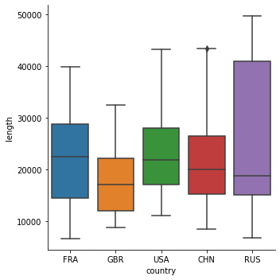
    


    
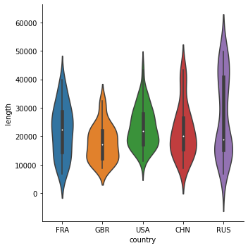
    


```python
# Visualizing developement over time:
df.groupby('year').size().plot(title='Number of Countries')
```


    <AxesSubplot:title={'center':'Number of Countries'}, xlabel='year'>


    
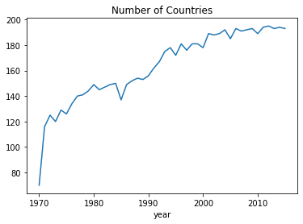
    


```python
df.groupby('year').agg({'length': 'mean'}).plot(title='Avg. Speech Length', ylim=(0, 30000))
```


    <AxesSubplot:title={'center':'Avg. Speech Length'}, xlabel='year'>


    
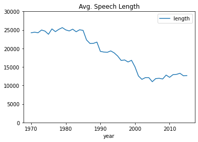
    


```python
df['length'].idxmax()
```


    1133


```python
# Longest speech:
df.loc[df['length'].idxmax()]
```


    session                                                        34
    year                                                         1979
    country                                                       CUB
    country_name                                                 Cuba
    speaker                                                    Castro
    position        President of the Council of State and of the G...
    text            I have not come to speak about Cuba, I have n...
    length                                                      72041
    Name: 1133, dtype: object


## <span style="color:blue">Performing Tokenization with Regular Expressions</span>


```python
pip install regex
```

We need the `regex` library instead of `re` to work with POSIX character classes.<br>
We use the POSIX character class `\p{L}` to select all unicode letters, since the expression `[A-Za-z]` misses  accented letters like ä or â.


```python
import regex as re

def tokenize(text):
    return re.findall(r'[\w-]*\p{L}[\w-]*', text)
```


```python
text = "Let's defeat SARS-CoV-2 together in 2020!"
tokens = tokenize(text)
print(" | ".join(tokens))
```

    Let | s | defeat | SARS-CoV-2 | together | in
    

## <span style="color:blue">Treating Stop Words</span>


```python
pip install nltk
```


```python
import nltk
```


```python
stopwords = set(nltk.corpus.stopwords.words('english'))
```


```python
def remove_stop(tokens):
    return [t for t in tokens if t.lower() not in stopwords]
```


```python
print(stopwords)
```

    {'you', 'will', 'nor', 'ain', 'all', 'what', 'through', 'doing', 've', 'some', 'hasn', 'a', 'just', 'them', "you're", 'her', 'too', 'each', "weren't", 'an', "she's", 'he', 'ours', 'both', 'being', 'no', 'have', "wouldn't", "isn't", 'we', "that'll", 'the', 'only', 'm', 'which', 'other', 'wouldn', 'been', 'has', 'off', 'herself', 'ma', 'is', "doesn't", "you've", 'own', 'this', 'those', 'as', "aren't", 'mustn', 'after', 'than', 'needn', 'their', 'do', 'because', 'our', 'doesn', "didn't", 'himself', 'wasn', 'itself', 'of', 'so', 'had', 'themselves', 'above', 'was', 'into', 'out', 'under', "mightn't", 'why', 'or', 'ourselves', 'in', 't', 'shouldn', 'such', 'at', 'for', 'your', 'whom', 'there', 'can', 'does', 'myself', "you'll", "don't", 'd', 'its', 'when', 'haven', 'by', 'once', 'any', 'these', 'more', 'o', 'but', 'theirs', "wasn't", 'again', 'yours', "won't", 's', 'and', 'didn', 'before', 'on', 'if', 'from', 'mightn', 'were', "it's", 'that', 'it', 'how', 'won', 'with', 'between', 'during', "needn't", 'about', "should've", 'him', 'below', 'not', 'are', 'then', 'down', 'until', 'over', 'i', 'most', 'where', "shouldn't", 'weren', 'to', 'she', "hasn't", "shan't", 'shan', 'am', 'very', 'same', 'up', 'll', 'few', 'don', 'be', 'y', "haven't", 'while', "hadn't", 'isn', 'here', 'aren', "couldn't", 'my', 'yourself', 'they', 'should', 're', 'having', 'hadn', 'did', 'yourselves', "mustn't", 'couldn', 'who', 'against', 'his', 'me', 'hers', 'now', 'further', "you'd"}
    


```python
print(len(stopwords))
```

    179
    

Often you’ll need to add domain-specific stop words to the predefined list. For exam‐
ple, if you are analyzing emails, the terms dear and regards will probably appear in
almost any document. On the other hand, you might want to treat some of the words
in the predefined list not as stop words. We can add additional stop words
and exclude others from the list using two of Python’s set operators, `|` (union/or) and `-` for (difference):


```python
include_stopwords = {'dear', 'regards', 'must', 'would', 'also'}
exclude_stopwords = {'against'}
stopwords |= include_stopwords
stopwords -= exclude_stopwords
```


```python
print(len(stopwords))
```

    183
    

The stop word list from NLTK is conservative and contains only 179 words. Surpris‐
ingly, would is not considered a stop word, while wouldn’t is. This illustrates a com‐
mon problem with predefined stop word lists: inconsistency. Be aware that removing
stop words can significantly affect the performance of semantically targeted analyses. <br>
For example, Both NLTK and spaCy have I and don’t (same as do not) in their stop word lists.  If
these stop words are removed from the corpus, any kind of sentiment analysis would be heavily affected.

> In addition to or instead of a fixed list of stop words, it can be helpful to treat every
word that appears in more than, say, 80% of the documents as a stop word.

### Processing a Pipeline with One Line of Code
We use an extensible pattern for a processing pipeline. In our case, we will change all text to lowercase, tokenize it, and remove stop words. Other operations can be added by simply extending the pipeline:


```python
pipeline = [str.lower, tokenize, remove_stop]
def prepare(text, pipeline):
    tokens = text
    for transform in pipeline:
        tokens = transform(tokens)
    return tokens
```

Adding a column for lists of tokens


```python
df['tokens'] = df['text'].apply(prepare, pipeline=pipeline)
```


```python
df.head()
```


<div>
<style scoped>
    .dataframe tbody tr th:only-of-type {
        vertical-align: middle;
    }

    .dataframe tbody tr th {
        vertical-align: top;
    }

    .dataframe thead th {
        text-align: right;
    }
</style>
<table border="1" class="dataframe">
  <thead>
    <tr style="text-align: right;">
      <th></th>
      <th>session</th>
      <th>year</th>
      <th>country</th>
      <th>country_name</th>
      <th>speaker</th>
      <th>position</th>
      <th>text</th>
      <th>length</th>
      <th>tokens</th>
    </tr>
  </thead>
  <tbody>
    <tr>
      <th>0</th>
      <td>25</td>
      <td>1970</td>
      <td>ALB</td>
      <td>Albania</td>
      <td>Mr. NAS</td>
      <td>NaN</td>
      <td>33: May I first convey to our President the co...</td>
      <td>51419</td>
      <td>[may, first, convey, president, congratulation...</td>
    </tr>
    <tr>
      <th>1</th>
      <td>25</td>
      <td>1970</td>
      <td>ARG</td>
      <td>Argentina</td>
      <td>Mr. DE PABLO PARDO</td>
      <td>NaN</td>
      <td>177.\t : It is a fortunate coincidence that pr...</td>
      <td>29286</td>
      <td>[fortunate, coincidence, precisely, time, unit...</td>
    </tr>
    <tr>
      <th>2</th>
      <td>25</td>
      <td>1970</td>
      <td>AUS</td>
      <td>Australia</td>
      <td>Mr. McMAHON</td>
      <td>NaN</td>
      <td>100.\t  It is a pleasure for me to extend to y...</td>
      <td>31839</td>
      <td>[pleasure, extend, mr, president, warmest, con...</td>
    </tr>
    <tr>
      <th>3</th>
      <td>25</td>
      <td>1970</td>
      <td>AUT</td>
      <td>Austria</td>
      <td>Mr. KIRCHSCHLAEGER</td>
      <td>NaN</td>
      <td>155.\t  May I begin by expressing to Ambassado...</td>
      <td>26616</td>
      <td>[may, begin, expressing, ambassador, hambro, b...</td>
    </tr>
    <tr>
      <th>4</th>
      <td>25</td>
      <td>1970</td>
      <td>BEL</td>
      <td>Belgium</td>
      <td>Mr. HARMEL</td>
      <td>NaN</td>
      <td>176. No doubt each of us, before coming up to ...</td>
      <td>25911</td>
      <td>[doubt, us, coming, rostrum, wonders, usefulne...</td>
    </tr>
  </tbody>
</table>
</div>


Adding another column for number of tokens


```python
df['num_tokens'] = df['tokens'].map(len)
```


```python
df.head()
```


<div>
<style scoped>
    .dataframe tbody tr th:only-of-type {
        vertical-align: middle;
    }

    .dataframe tbody tr th {
        vertical-align: top;
    }

    .dataframe thead th {
        text-align: right;
    }
</style>
<table border="1" class="dataframe">
  <thead>
    <tr style="text-align: right;">
      <th></th>
      <th>session</th>
      <th>year</th>
      <th>country</th>
      <th>country_name</th>
      <th>speaker</th>
      <th>position</th>
      <th>text</th>
      <th>length</th>
      <th>tokens</th>
      <th>num_tokens</th>
    </tr>
  </thead>
  <tbody>
    <tr>
      <th>0</th>
      <td>25</td>
      <td>1970</td>
      <td>ALB</td>
      <td>Albania</td>
      <td>Mr. NAS</td>
      <td>NaN</td>
      <td>33: May I first convey to our President the co...</td>
      <td>51419</td>
      <td>[may, first, convey, president, congratulation...</td>
      <td>4125</td>
    </tr>
    <tr>
      <th>1</th>
      <td>25</td>
      <td>1970</td>
      <td>ARG</td>
      <td>Argentina</td>
      <td>Mr. DE PABLO PARDO</td>
      <td>NaN</td>
      <td>177.\t : It is a fortunate coincidence that pr...</td>
      <td>29286</td>
      <td>[fortunate, coincidence, precisely, time, unit...</td>
      <td>2327</td>
    </tr>
    <tr>
      <th>2</th>
      <td>25</td>
      <td>1970</td>
      <td>AUS</td>
      <td>Australia</td>
      <td>Mr. McMAHON</td>
      <td>NaN</td>
      <td>100.\t  It is a pleasure for me to extend to y...</td>
      <td>31839</td>
      <td>[pleasure, extend, mr, president, warmest, con...</td>
      <td>2545</td>
    </tr>
    <tr>
      <th>3</th>
      <td>25</td>
      <td>1970</td>
      <td>AUT</td>
      <td>Austria</td>
      <td>Mr. KIRCHSCHLAEGER</td>
      <td>NaN</td>
      <td>155.\t  May I begin by expressing to Ambassado...</td>
      <td>26616</td>
      <td>[may, begin, expressing, ambassador, hambro, b...</td>
      <td>2135</td>
    </tr>
    <tr>
      <th>4</th>
      <td>25</td>
      <td>1970</td>
      <td>BEL</td>
      <td>Belgium</td>
      <td>Mr. HARMEL</td>
      <td>NaN</td>
      <td>176. No doubt each of us, before coming up to ...</td>
      <td>25911</td>
      <td>[doubt, us, coming, rostrum, wonders, usefulne...</td>
      <td>2025</td>
    </tr>
  </tbody>
</table>
</div>


## <span style="color:blue">Blueprints for Word Frequency Analysis</span>

**1- Blueprint: Counting Words with a Counter**

How to use a counter:


```python
from collections import Counter

tokens = tokenize("She likes my cats and my cats like my sofa.")
counter = Counter(tokens)
print(counter)
```

    Counter({'my': 3, 'cats': 2, 'She': 1, 'likes': 1, 'and': 1, 'like': 1, 'sofa': 1})
    

What’s nice about the counter is that it can be incrementally updated with a list of
tokens of a second document:


```python
more_tokens = tokenize("She likes dogs and cats.")
counter.update(more_tokens)
print(counter)
```

    Counter({'my': 3, 'cats': 3, 'She': 2, 'likes': 2, 'and': 2, 'like': 1, 'sofa': 1, 'dogs': 1})
    


```python
counter = Counter()
df['tokens'].map(counter.update)
```


    0       None
    1       None
    2       None
    3       None
    4       None
            ... 
    7502    None
    7503    None
    7504    None
    7505    None
    7506    None
    Name: tokens, Length: 7507, dtype: object


Retrieving most common words


```python
print(counter.most_common(5))
```

    [('nations', 124508), ('united', 120763), ('international', 117223), ('world', 89421), ('countries', 85734)]
    

it is much more convenient to transform the counter into a Pandas DataFrame:


```python
def count_words(df, column='tokens', preprocess=None, min_freq=2):
    
    # process tokens and update counter
    def update(doc):
        tokens = doc if preprocess is None else preprocess(doc)
        counter.update(tokens)
        
    # create counter and run through all data
    counter = Counter()
    df[column].map(update)
    
    # transform counter into a DataFrame
    freq_df = pd.DataFrame.from_dict(counter, orient='index', columns=['freq'])
    freq_df = freq_df.query('freq >= @min_freq')
    freq_df.index.name = 'token'
    return freq_df.sort_values('freq', ascending=False)
```


```python
freq_df = count_words(df)
freq_df.head(5)
```


<div>
<style scoped>
    .dataframe tbody tr th:only-of-type {
        vertical-align: middle;
    }

    .dataframe tbody tr th {
        vertical-align: top;
    }

    .dataframe thead th {
        text-align: right;
    }
</style>
<table border="1" class="dataframe">
  <thead>
    <tr style="text-align: right;">
      <th></th>
      <th>freq</th>
    </tr>
    <tr>
      <th>token</th>
      <th></th>
    </tr>
  </thead>
  <tbody>
    <tr>
      <th>nations</th>
      <td>124508</td>
    </tr>
    <tr>
      <th>united</th>
      <td>120763</td>
    </tr>
    <tr>
      <th>international</th>
      <td>117223</td>
    </tr>
    <tr>
      <th>world</th>
      <td>89421</td>
    </tr>
    <tr>
      <th>countries</th>
      <td>85734</td>
    </tr>
  </tbody>
</table>
</div>


If we don’t want to use precomputed tokens for some special analysis, we could tokenize the text on the fly with a custom preprocessing function as the third parameter. For example, we could generate and count all words with 10 or more characters with this on-the-fly tokenization of the text:


```python
count_words(df, column='text', preprocess=lambda text: re.findall(r'\w{10,}', text))
```


<div>
<style scoped>
    .dataframe tbody tr th:only-of-type {
        vertical-align: middle;
    }

    .dataframe tbody tr th {
        vertical-align: top;
    }

    .dataframe thead th {
        text-align: right;
    }
</style>
<table border="1" class="dataframe">
  <thead>
    <tr style="text-align: right;">
      <th></th>
      <th>freq</th>
    </tr>
    <tr>
      <th>token</th>
      <th></th>
    </tr>
  </thead>
  <tbody>
    <tr>
      <th>international</th>
      <td>106974</td>
    </tr>
    <tr>
      <th>development</th>
      <td>51334</td>
    </tr>
    <tr>
      <th>Government</th>
      <td>35528</td>
    </tr>
    <tr>
      <th>Organization</th>
      <td>33763</td>
    </tr>
    <tr>
      <th>developing</th>
      <td>25177</td>
    </tr>
    <tr>
      <th>...</th>
      <td>...</td>
    </tr>
    <tr>
      <th>enfranchising</th>
      <td>2</td>
    </tr>
    <tr>
      <th>interrelate</th>
      <td>2</td>
    </tr>
    <tr>
      <th>compositions</th>
      <td>2</td>
    </tr>
    <tr>
      <th>extensiveness</th>
      <td>2</td>
    </tr>
    <tr>
      <th>subcommission</th>
      <td>2</td>
    </tr>
  </tbody>
</table>
<p>11236 rows × 1 columns</p>
</div>


**2- Blueprint: Creating a Frequency Diagram**


```python
ax = freq_df.head(15).plot(kind='barh', width=0.95)
ax.invert_yaxis()
ax.set(xlabel='Frequency', ylabel='Token', title='Top words')
```


    [Text(0.5, 0, 'Frequency'), Text(0, 0.5, 'Token'), Text(0.5, 1.0, 'Top words')]


    
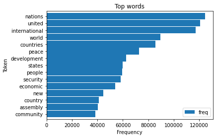
    


**3- Blueprint: Creating Word Clouds**


```python
pip install wordcloud
```


```python
from wordcloud import WordCloud

text = df.query("year==2015 and country=='USA'")['text'].values[0]
wc = WordCloud(max_words=100, stopwords=stopwords)
wc.generate(text)
plt.imshow(wc, interpolation='bilinear')
plt.axis('off')
```


    (-0.5, 399.5, 199.5, -0.5)


    

    


However, this works only for a single text and not a (potentially large) set of documents. For the latter use case, it is much faster to create a frequency counter first and then use the function generate_from_frequencies().


```python
def wordcloud(word_freq, title=None, max_words=200, stopwords=None):
    
    wc = WordCloud(width=800, height=400, background_color= "black", colormap="Paired", 
                   max_font_size=150, max_words=max_words)
    
    # convert DataFrame into dict
    if type(word_freq) == pd.Series:
        counter = Counter(word_freq.fillna(0).to_dict())
    else:
        counter = word_freq
    
    # filter stop words in frequency counter
    if stopwords is not None:
        counter = {token:freq for (token, freq) in counter.items() if token not in stopwords}
        
    wc.generate_from_frequencies(counter)
    plt.title(title)
    plt.imshow(wc, interpolation='bilinear')
    plt.axis("off")
```


```python
freq_2015_df = count_words(df[df['year']==2015])
plt.figure()
wordcloud(freq_2015_df['freq'], max_words=100)
```


    

    


>Word Cloud showing the most frequent words without filters


```python
wordcloud(freq_2015_df['freq'], max_words=100, stopwords=freq_df.head(50).index)
```


    

    


>The second word cloud shows the most frequent words after excluding the 50 most frequent words by including them in the stopwords list

**4- Blueprint: Ranking with TF-IDF**

>Inverse Document Frequency<br>
The inverse document frequency (IDF) is a weighting factor that measures the “unusualness” of a term in a corpus. It is often used to reduce the influence of common terms for data analysis or machine learning.

Let’s define a function to compute the IDF for all terms in the corpus


```python
import numpy as np
```


```python
def compute_idf(df, column='tokens', preprocess=None, min_df=2):
    def update(doc):
        tokens = doc if preprocess is None else preprocess(doc)
        counter.update(set(tokens))
    
    # count tokens
    counter = Counter()
    df[column].map(update)
    
    # create DataFrame and compute idf
    idf_df = pd.DataFrame.from_dict(counter, orient='index', columns=['df'])
    idf_df = idf_df.query('df >= @min_df')
    idf_df['idf'] = np.log(len(df)/idf_df['df'])+0.1
    idf_df.index.name = 'token'
    
    return idf_df
```


```python
idf_df = compute_idf(df)
```


```python
freq_df['tfidf'] = freq_df['freq'] * idf_df['idf']
```


```python
freq_1970 = count_words(df[df['year'] == 1970])
freq_1970['tfidf'] = freq_1970['freq'] * idf_df['idf']
#wordcloud(freq_df['freq'], title='All years', subplot=(1,3,1))
wordcloud(freq_1970['freq'], title='1970 - TF', stopwords=['twenty-fifth', 'twenty-five'])
```


    
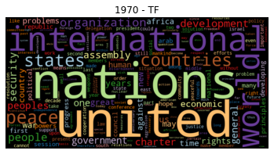
    


```python
freq_2015 = count_words(df[df['year'] == 2015])
freq_2015['tfidf'] = freq_2015['freq'] * idf_df['idf']
wordcloud(freq_2015['freq'], title='2015 - TF', stopwords=['seventieth'])
```


    

    


```python
wordcloud(freq_1970['tfidf'], title='1970 - TF-IDF', stopwords=['twenty-fifth', 'twenty-five', 'twenty', 'fifth'])
```


    

    


```python
wordcloud(freq_2015['tfidf'], title='2015 - TF-IDF', stopwords=['seventieth'])
```


    
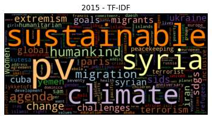
    


The word clouds impressively demonstrate the power of TF-IDF weighting. While the most common words are almost identical in 1970 and 2015, the TF-IDF weighted visualizations emphasize the differences of political topics.

**5- Blueprint: Finding a Keyword-in-Context KWIC**

KWIC analysis produces a list of text fragments of equal length showing the left and right context of a keyword


```python
pip install textacy
```


```python
from textacy.extract.kwic import keyword_in_context
import random

def KWIC(*args, **kwargs):
    # call keyword_in_context with all params except 'print_only'
    return keyword_in_context(*args, 
                       **{kw: arg for kw, arg in kwargs.items() 
                        if kw != 'print_only'})

def kwic(doc_series, keyword, window=35, print_samples=5):

    def add_kwic(text):
        kwic_list.extend(KWIC(text, keyword, ignore_case=True, 
                              window_width=window, print_only=False))

    kwic_list = []
    doc_series.map(add_kwic)

    if print_samples is None or print_samples==0:
        return kwic_list
    else:
        k = min(print_samples, len(kwic_list))
        print(f"{k} random samples out of {len(kwic_list)} " + \
              f"contexts for '{keyword}':")
        for sample in random.sample(list(kwic_list), k):
            print(re.sub(r'[\n\t]', ' ', sample[0])+'  '+ \
                  sample[1]+'  '+\
                  re.sub(r'[\n\t]', ' ', sample[2]))
```


```python
kwic(df[df['year'] == 2015]['text'], 'sdgs', print_samples=5)
```

    5 random samples out of 73 contexts for 'sdgs':
    the Sustainable Development Goals (  SDGs  ). In other words, it is addressing
     If we are ambitious in all our 17   SDGs  , let us not be any less ambitious 
     proposed remedies. Above all, the   SDGs   proclaim in bold letters the conce
     17 Sustainable Development Goals (  SDGs  ) with their 169 targets. We sincer
    ead by example in implementing the   SDGs   in Bangladesh. Attaching due impor
    


```python
kwic(df[df['year'] == 2015]['text'], 'sam', print_samples=5)
```

    5 random samples out of 327 contexts for 'sam':
     to express my appreciation to Mr.   Sam   Kutesa for the tremendous work tha
     health care and education. At the   sam  e time, Cuba has provided capacity-
    oing President, His Excellency Mr.   Sam   Kutesa, for the sterling job he di
    chronized with our own to show the   sam  e time — a time for peace, a time f
    . We also wish to congratulate Mr.   Sam   Kahamba Kutesa, who brilliantly pr
    

**6- Blueprint: Analyzing N-Grams**


```python
def ngrams(tokens, n=2, sep=' '):
    return [sep.join(ngram) for ngram in zip(*[tokens[i:] for i in range(n)])]

# Example:
text = "the visible manifestation of the global climate change"
tokens = tokenize(text)
print(" | ".join(ngrams(tokens, 2)))
```

    the visible | visible manifestation | manifestation of | of the | the global | global climate | climate change
    

>As you can see, most of the bigrams contain stop words like prepositions and determiners. Thus, it is advisable to build bigrams without stop words. But we need to be careful: if we remove the stop words first and then build the bigrams, we generate bigrams that don’t exist in the original text as a “manifestation global” in the example.
Thus, we create the bigrams on all tokens but keep only those that do not contain any stop words with this modified ngrams function:


```python
def ngrams(tokens, n=2, sep=' ', stopwords=set()):
    return [sep.join(ngram) for ngram in zip(*[tokens[i:] for i in range(n)]) 
            if len([t for t in ngram if t in stopwords]) == 0]

# Examples:
print('Bigrams:', " | ".join(ngrams(tokens, 2, stopwords=stopwords)))
print('Trigrams:', " | ".join(ngrams(tokens, 3, stopwords=stopwords)))
```

    Bigrams: visible manifestation | global climate | climate change
    Trigrams: global climate change
    

Using this ngrams function, Let's add a column containing all bigrams to our Data Frame and apply the word count blueprint to determine the top five bigrams:


```python
df['bigrams'] = df['text'].apply(prepare, pipeline=[str.lower, tokenize]).apply(ngrams, n=2, stopwords=stopwords)
```


```python
df.head()
```


<div>
<style scoped>
    .dataframe tbody tr th:only-of-type {
        vertical-align: middle;
    }

    .dataframe tbody tr th {
        vertical-align: top;
    }

    .dataframe thead th {
        text-align: right;
    }
</style>
<table border="1" class="dataframe">
  <thead>
    <tr style="text-align: right;">
      <th></th>
      <th>session</th>
      <th>year</th>
      <th>country</th>
      <th>country_name</th>
      <th>speaker</th>
      <th>position</th>
      <th>text</th>
      <th>length</th>
      <th>tokens</th>
      <th>num_tokens</th>
      <th>bigrams</th>
    </tr>
  </thead>
  <tbody>
    <tr>
      <th>0</th>
      <td>25</td>
      <td>1970</td>
      <td>ALB</td>
      <td>Albania</td>
      <td>Mr. NAS</td>
      <td>NaN</td>
      <td>33: May I first convey to our President the co...</td>
      <td>51419</td>
      <td>[may, first, convey, president, congratulation...</td>
      <td>4125</td>
      <td>[first convey, albanian delegation, twenty-fif...</td>
    </tr>
    <tr>
      <th>1</th>
      <td>25</td>
      <td>1970</td>
      <td>ARG</td>
      <td>Argentina</td>
      <td>Mr. DE PABLO PARDO</td>
      <td>NaN</td>
      <td>177.\t : It is a fortunate coincidence that pr...</td>
      <td>29286</td>
      <td>[fortunate, coincidence, precisely, time, unit...</td>
      <td>2327</td>
      <td>[fortunate coincidence, united nations, first ...</td>
    </tr>
    <tr>
      <th>2</th>
      <td>25</td>
      <td>1970</td>
      <td>AUS</td>
      <td>Australia</td>
      <td>Mr. McMAHON</td>
      <td>NaN</td>
      <td>100.\t  It is a pleasure for me to extend to y...</td>
      <td>31839</td>
      <td>[pleasure, extend, mr, president, warmest, con...</td>
      <td>2545</td>
      <td>[mr president, warmest congratulations, austra...</td>
    </tr>
    <tr>
      <th>3</th>
      <td>25</td>
      <td>1970</td>
      <td>AUT</td>
      <td>Austria</td>
      <td>Mr. KIRCHSCHLAEGER</td>
      <td>NaN</td>
      <td>155.\t  May I begin by expressing to Ambassado...</td>
      <td>26616</td>
      <td>[may, begin, expressing, ambassador, hambro, b...</td>
      <td>2135</td>
      <td>[ambassador hambro, best wishes, general assem...</td>
    </tr>
    <tr>
      <th>4</th>
      <td>25</td>
      <td>1970</td>
      <td>BEL</td>
      <td>Belgium</td>
      <td>Mr. HARMEL</td>
      <td>NaN</td>
      <td>176. No doubt each of us, before coming up to ...</td>
      <td>25911</td>
      <td>[doubt, us, coming, rostrum, wonders, usefulne...</td>
      <td>2025</td>
      <td>[rostrum wonders, still speak, mournful cries,...</td>
    </tr>
  </tbody>
</table>
</div>


```python
count_words(df, 'bigrams').head()
```


<div>
<style scoped>
    .dataframe tbody tr th:only-of-type {
        vertical-align: middle;
    }

    .dataframe tbody tr th {
        vertical-align: top;
    }

    .dataframe thead th {
        text-align: right;
    }
</style>
<table border="1" class="dataframe">
  <thead>
    <tr style="text-align: right;">
      <th></th>
      <th>freq</th>
    </tr>
    <tr>
      <th>token</th>
      <th></th>
    </tr>
  </thead>
  <tbody>
    <tr>
      <th>united nations</th>
      <td>103236</td>
    </tr>
    <tr>
      <th>international community</th>
      <td>27786</td>
    </tr>
    <tr>
      <th>general assembly</th>
      <td>27096</td>
    </tr>
    <tr>
      <th>security council</th>
      <td>20961</td>
    </tr>
    <tr>
      <th>human rights</th>
      <td>19856</td>
    </tr>
  </tbody>
</table>
</div>


Now let’s extend our TF-IDF-based unigram analysis from the previous section and include bigrams.


```python
# concatenate existing IDF DataFrame with bigram IDFs
idf_df = pd.concat([idf_df, compute_idf(df, 'bigrams', min_df=10)])

freq_df = count_words(df[df['year'] == 2015], 'bigrams')
freq_df['tfidf'] = freq_df['freq'] * idf_df['idf']
wordcloud(freq_df['tfidf'], title='all bigrams', max_words=50)
```

    C:\Users\nzaye\AppData\Local\Temp\ipykernel_13212\2978621610.py:13: SettingWithCopyWarning: 
    A value is trying to be set on a copy of a slice from a DataFrame.
    Try using .loc[row_indexer,col_indexer] = value instead
    
    See the caveats in the documentation: https://pandas.pydata.org/pandas-docs/stable/user_guide/indexing.html#returning-a-view-versus-a-copy
      idf_df['idf'] = np.log(len(df)/idf_df['df'])+0.1
    


    

    


To understand the different contexts of climate, it may be interesting to take a look at the bigrams containing climate only. We can use a text filter on climate to achieve this:


```python
where = freq_df.index.str.contains('climate')
wordcloud(freq_df[where]['freq'], title='"cliamte" bigrams', max_words=50)
```


    
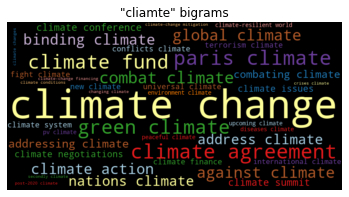
    


**7- Blueprint: Comparing Frequencies Across Time Intervals and Categories**

***Creating Frequency Timelines:***<br>
Our approach is to calculate the frequencies of given keywords per document and then aggregate those frequencies using Pandas’s groupby function. 


```python
# This function is for the first task:
def count_keywords(tokens, keywords):
    tokens = [t for t in tokens if t in keywords]
    counter = Counter(tokens)
    return [counter.get(k, 0) for k in keywords]
```


```python
# Example:
keywords = ['nuclear', 'terrorism', 'climate', 'freedom']
tokens = ['nuclear', 'climate', 'climate', 'freedom', 'climate', 'freedom']
print(count_keywords(tokens, keywords))
```

    [1, 0, 3, 2]
    

>The function returns a list or vector of word counts. In fact, it’s a very simple count-vectorizer for keywords. If we apply this function to each document in our DataFrame, we get a matrix of counts. The function count_keywords_by, shown next, does exactly this as a first step. The matrix is then again converted into a DataFrame that is finally aggregated and sorted by the supplied grouping column.


```python
def count_keywords_by(df, by, keywords, column='tokens'):
    
    freq_matrix = df[column].apply(count_keywords, keywords=keywords)
    freq_df = pd.DataFrame.from_records(freq_matrix, columns=keywords)
    freq_df[by] = df[by]
    
    return freq_df.groupby(by=by).sum().sort_values(by)
```


```python
freq_df = count_keywords_by(df, by='year', keywords=keywords)
```


```python
print(freq_df)
```

          nuclear  terrorism  climate  freedom
    year                                      
    1970      192          7       18      128
    1971      275          9       35      205
    1972      393        379       74      280
    1973      347        124       79      266
    1974      478         24       71      316
    1975      578         20       53      232
    1976      451        146       57      347
    1977      675         75       58      321
    1978      550         82       52      309
    1979      492         40       81      366
    1980      613         47      105      350
    1981      717         96      122      349
    1982      657         83      119      280
    1983      776         42      112      354
    1984      890        113      115      314
    1985      809        144      104      301
    1986      807        356      103      270
    1987      652        154      102      302
    1988      562        112      222      236
    1989      399        156      287      282
    1990      269         51      177      297
    1991      396         41      162      360
    1992      325         38      116      244
    1993      389         64       97      211
    1994      428         85       72      185
    1995      634         99       83      147
    1996      593        233       85      110
    1997      267        165       85       86
    1998      593        459       96      150
    1999      315        194       82      169
    2000      268        127       61      107
    2001      114       1477       83      115
    2002      150        898       81       94
    2003      204        671       76      142
    2004      157        743       78      128
    2005      262        609       86      179
    2006      225        479      102      132
    2007      246        353      788      142
    2008      147        290      565      145
    2009      431        197      861      100
    2010      414        249      618      119
    2011      227        257      510      283
    2012      254        198      340      305
    2013      260        216      349      177
    2014      144        404      654      129
    2015      246        378      662      148
    


```python
print(type(freq_df))
```

    <class 'pandas.core.frame.DataFrame'>
    


```python
freq_df.head()
```


<div>
<style scoped>
    .dataframe tbody tr th:only-of-type {
        vertical-align: middle;
    }

    .dataframe tbody tr th {
        vertical-align: top;
    }

    .dataframe thead th {
        text-align: right;
    }
</style>
<table border="1" class="dataframe">
  <thead>
    <tr style="text-align: right;">
      <th></th>
      <th>nuclear</th>
      <th>terrorism</th>
      <th>climate</th>
      <th>freedom</th>
    </tr>
    <tr>
      <th>year</th>
      <th></th>
      <th></th>
      <th></th>
      <th></th>
    </tr>
  </thead>
  <tbody>
    <tr>
      <th>1970</th>
      <td>192</td>
      <td>7</td>
      <td>18</td>
      <td>128</td>
    </tr>
    <tr>
      <th>1971</th>
      <td>275</td>
      <td>9</td>
      <td>35</td>
      <td>205</td>
    </tr>
    <tr>
      <th>1972</th>
      <td>393</td>
      <td>379</td>
      <td>74</td>
      <td>280</td>
    </tr>
    <tr>
      <th>1973</th>
      <td>347</td>
      <td>124</td>
      <td>79</td>
      <td>266</td>
    </tr>
    <tr>
      <th>1974</th>
      <td>478</td>
      <td>24</td>
      <td>71</td>
      <td>316</td>
    </tr>
  </tbody>
</table>
</div>


```python
freq_df.plot(kind='line')
```


    <AxesSubplot:xlabel='year'>


    
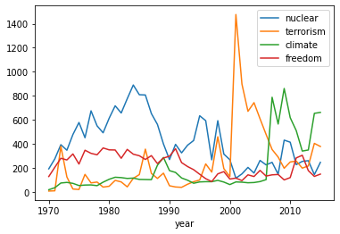
    


```python
# analyzing mentions of 'climate' before 1980
kwic(df.query('year < 1980')['text'], 'climate', window=35, print_samples=5)
```

    5 random samples out of 581 contexts for 'climate':
    e among the great Powers. This new   climate   will perhaps make it possible for 
    s of promoting a healthy political   climate   in the world. 107. As far back as 
    that are inherent in the political   climate   and situation that prevail in the 
    re' in the international political   climate  . If this were so, why should they 
    e improvement of the international   climate   achieved so far is a result of the
    

>The use of the word climate before 1980 was almost exclusively used in a figurative sense, and not related to climate change

***Creating Frequency Heatmaps:***


```python
keywords = ['terrorism', 'terrorist', 'nuclear', 'war', 'oil', 'syria', 'syrian', 'refugees', 
            'migration', 'peacekeeping', 'humanitarian', 'climate', 'change', 'sustainable', 'sdgs']

freq_df = count_keywords_by(df, by='year', keywords=keywords)

# compute relative frequencies based on total number of tokens per year
freq_df = freq_df.div(df.groupby('year')['num_tokens'].sum(), axis=0)

# apply square root as sublinear filter for better contrast
freq_df = freq_df.apply(np.sqrt)

plt.figure(figsize=(10, 3))
sns.set(font_scale=1)

sns.heatmap(data=freq_df.T, xticklabels=True, yticklabels=True, cbar=False, cmap="Reds")
```


    <AxesSubplot:xlabel='year'>


    
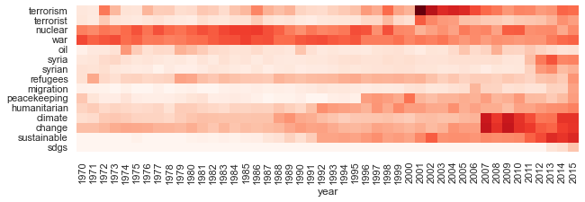
    


There are a few things to consider for this kind of analysis:<br>
***Prefer relative frequencies for any kind of comparison.***<br>
Absolute term frequencies are problematic if the total number of tokens per year or category is not stable. For example, absolute frequencies naturally go up if more countries are speaking year after year in our example.<br>
***Be careful with the interpretation of frequency diagrams based on keyword lists.***<br>
Although the chart looks like a distribution of topics, it is not! There may be other words representing the same topic but not included in the list. Keywords may also have different meanings (e.g., “climate of the discussion”). Advanced techniques such as topic modeling (Chapter 8) and word embeddings (Chapter 10) can help here.<br>
***Use sublinear scaling.***<br>
As the frequency values differ greatly, it may be hard to see any change for less-frequent tokens. Therefore, you should scale the frequencies sublinearly (we applied the square root np.sqrt). The visual effect is similar to lowering contrast.

**Closing Remarks:**<br>
For larger projects, we recommend setting up a search engine like Apache SOLR, Elasticsearch, or Tantivy. Those platforms create specialized indexes (also using TF-IDF weighting) for fast full-text search. Python APIs are available for all of them.


```python

```
